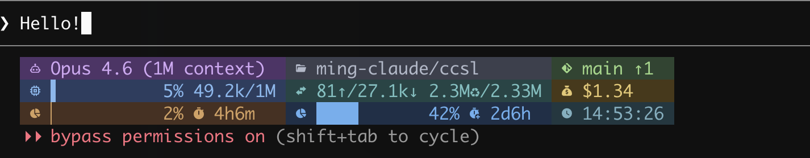
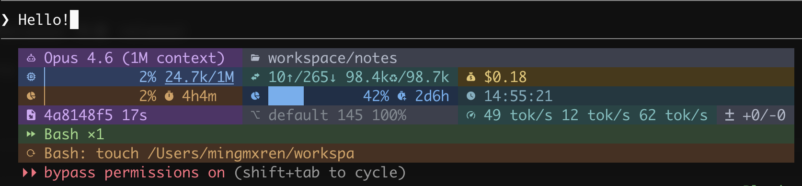

# CCSL — Claude Code StatusLine

A custom status line for [Claude Code](https://docs.anthropic.com/en/docs/claude-code) that displays real-time session information using Nerd Font icons and ANSI colors.

**Standard preset:**



**Full preset:**



## Features

- **16 segment groups** — model, git, context window, tokens, cost, API usage, weekly stats, version, session, speed, diff, activity, live, cwd, clock, environment
- **8 color themes** — Catppuccin, Cyberpunk, Dracula, Gruvbox, High Contrast, Monochrome, Nord, Solarized Light (with block variants)
- **4 presets** — minimal, standard, full, dev
- **TUI config editor** — run `ccsl` interactively to configure themes, presets, and segments
- **SmartAlign rendering** — intelligent width management with cross-line alignment
- **Variable-width segments** — graceful truncation when terminal space is limited

## Install

### Pre-built binary (recommended)

```sh
curl -sSfL https://raw.githubusercontent.com/ming-claude/ccsl/main/install.sh | sh
```

Or download from [GitHub Releases](https://github.com/ming-claude/ccsl/releases) and place the binary in your `PATH`.

### Go install

Requires Go 1.25+:

```sh
go install github.com/ming-claude/ccsl@latest
```

### Build from source

```sh
git clone https://github.com/ming-claude/ccsl.git
cd ccsl
make build
# binary: ./ccsl
```

## Setup

Add to `~/.claude/settings.json`:

```json
{
  "statusLine": {
    "type": "command",
    "command": "ccsl"
  }
}
```

Claude Code will pipe session data to `ccsl` via stdin, and `ccsl` renders the status line to stdout.

## Configuration

Run `ccsl` directly in a terminal (not piped) to open the TUI config editor:

```sh
ccsl
```

The config editor lets you:
- Choose a color theme
- Select a preset layout
- Enable/disable individual segments

Config is saved to `~/.claude/ccsl/config.json`.

## Themes

| Theme | Style | Description |
|-------|-------|-------------|
| Catppuccin | Dark, soft pastel | Community-favorite warm dark theme |
| Cyberpunk | Dark, neon | Hot pink, electric blue, fluorescent green |
| Dracula | Dark, saturated | High-saturation cool dark theme |
| Gruvbox | Dark, warm | Earthy warm tones with yellow-green accents |
| High Contrast | Dark, accessible | WCAG AA compliant bright-on-black |
| Monochrome | Dark, minimal | Single cyan hue, brightness-only differentiation |
| Nord | Dark, arctic | Cool blue-grey, low saturation |
| Solarized Light | Light (block only) | Solarized official light palette |

Each theme has both non-block and block variants, except Solarized Light (block only).

## Presets

- **minimal** — single line: model, context, cost, git (compact overview)
- **standard** — 3 lines: model/cwd/git, context/tokens/cost, usage/version
- **full** — 5 lines: all 16 segment groups enabled
- **dev** — 4 lines: model/context/tokens/cost, usage stats, git/diff, activity

## Requirements

- A terminal with [Nerd Font](https://www.nerdfonts.com/) installed (for icons)
- Claude Code with status line support

## Disclaimer

This is an **unofficial community project** and is not affiliated with, endorsed by, or sponsored by Anthropic. "Claude" is a trademark of Anthropic. This project uses the name solely to describe its functionality as a status line for Claude Code.

## License

[MIT](LICENSE)
